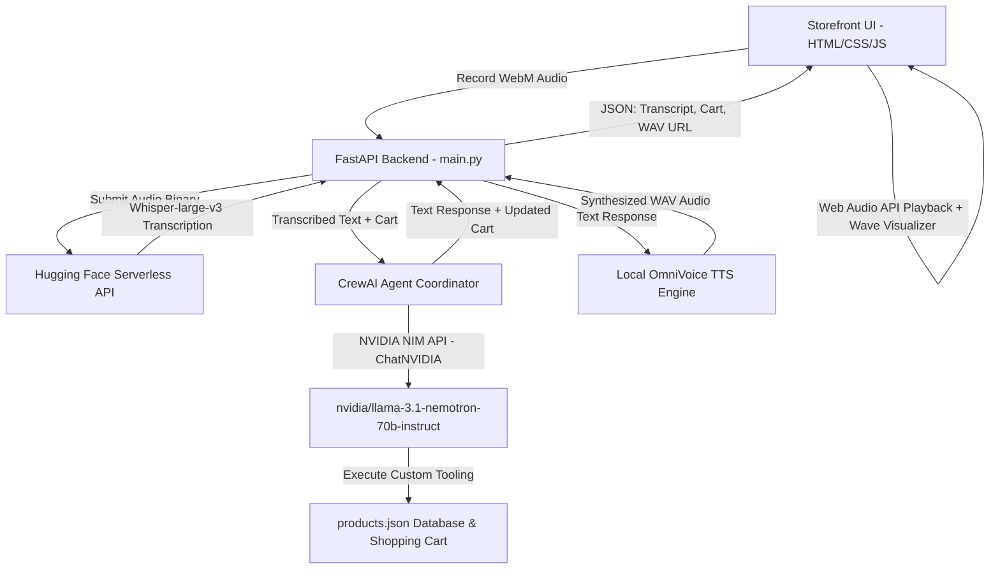

# VALENTI AI | Premium Voice-Activated Couture Storefront

Valenti AI is a modern, dark-themed, glassmorphic luxury digital storefront featuring a zero-touch voice-control assistant. Built with an optimized hybrid design, it allows you to explore, select, and purchase premium clothing and accessories using only your natural voice.

The system is coordinated by a local **FastAPI** backend that acts as the dispatch hub for a **CrewAI** multi-agent workflow powered by advanced **NVIDIA NIM LLMs**, transcribes audio inputs via cloud-hosted **Whisper-large-v3**, and responds in real-time with spoken answers synthesized by local GPU-accelerated **OmniVoice**.

---

## Technical Architecture & Core Tech Stack



1. **Client Core**: Vanilla HTML5, premium custom glassmorphic CSS animations, canvas-based audio wave visualizations, and native JavaScript managing state, MediaRecorder mic capture, and Web Audio API playback.
2. **Backend Hub**: **FastAPI** serving static assets and hosting real-time WebSocket/REST endpoints.
3. **ASR Module**: Cloud-hosted **Whisper-large-v3** via serverless APIs (0MB local VRAM footprint).
4. **TTS Module**: Local **OmniVoice** running fully offline on your GPU, enabling zero-shot voice design for elegant, natural vocal synthesis.
5. **Agentic System**: **CrewAI** orchestrating two highly tailored agents:
   * **Elite Personal Fashion Consultant**: Searches catalog inventory and tailors luxury clothing recommendations.
   * **Meticulous Order Operations Manager**: Manipulates quantities in the user's active cart and completes checkouts.
6. **Agent Brain**: **NVIDIA NIM** LLM endpoint running `nvidia/llama-3.1-nemotron-70b-instruct` for outstanding zero-shot instruction following and perfect multi-tool execution.

---

## 5060 Ti GPU & VRAM Memory Management

To ensure both voice models and the agent system run smoothly on an **NVIDIA 5060 Ti** (usually 8GB–12GB VRAM) without memory exhaust crashes or sluggishness, we engineered a smart **hybrid execution model**:

* **Cloud-Side (0MB VRAM):**
  * **Whisper ASR:** Utilizing Hugging Face's serverless pipeline for Whisper-large-v3 keeps 5GB of weights off your GPU entirely, yielding sub-second transcriptions for free.
  * **NVIDIA NIM Agents:** Conversational reasoning is dispatched to NVIDIA's cloud NIM nodes. This keeps large LLM weights (70 Billion parameter models) out of your VRAM.
* **Local-Side (CUDA Accelerated):**
  * **OmniVoice TTS:** The local text-to-speech model is loaded into VRAM utilizing float16 half-precision (`torch.float16`). This fits comfortably within the 5060 Ti VRAM budget, offering exceptionally fast real-time audio synthesis (real-time factor of 0.025, or 40x faster than real-time).

---

## Quick Start Guide

### Prerequisites
Make sure your environment variables are configured in the `.env` file at the root directory:
* `HUGGINGFACE_API_KEY`: Used to authenticate cloud ASR.
* `NVIDIA_NIM_API_KEY`: Used to query the agent's LLM.

### 1. Launch the Server
Ensure the virtual environment is used. Run the FastAPI development server from your terminal:
```powershell
# In d:\AI Projects in Antigravity\whisper_voice_agent
& ".venv\Scripts\python.exe" -m uvicorn main:app --reload --port 8000
```

### 2. Load the Storefront
Open your browser and navigate to:
```url
http://localhost:8000
```

### 3. Voice Interaction
1. Click the floating **VALENTI AI Stylist** widget at the bottom right.
2. Click the **Microphone** button (grant permission if prompted).
3. Speak clearly: *"I would like to look at watches. Can you find a minimalist watch and add it to my cart?"*
4. Click the **Microphone** button again to stop recording.
5. The visualizer will draw your audio, the AI will think, the product will be added to the cart on screen, and the stylist will read its premium recommendation back to you in a natural voice.
6. When you are ready to buy, simply speak: *"Please place my order."*
