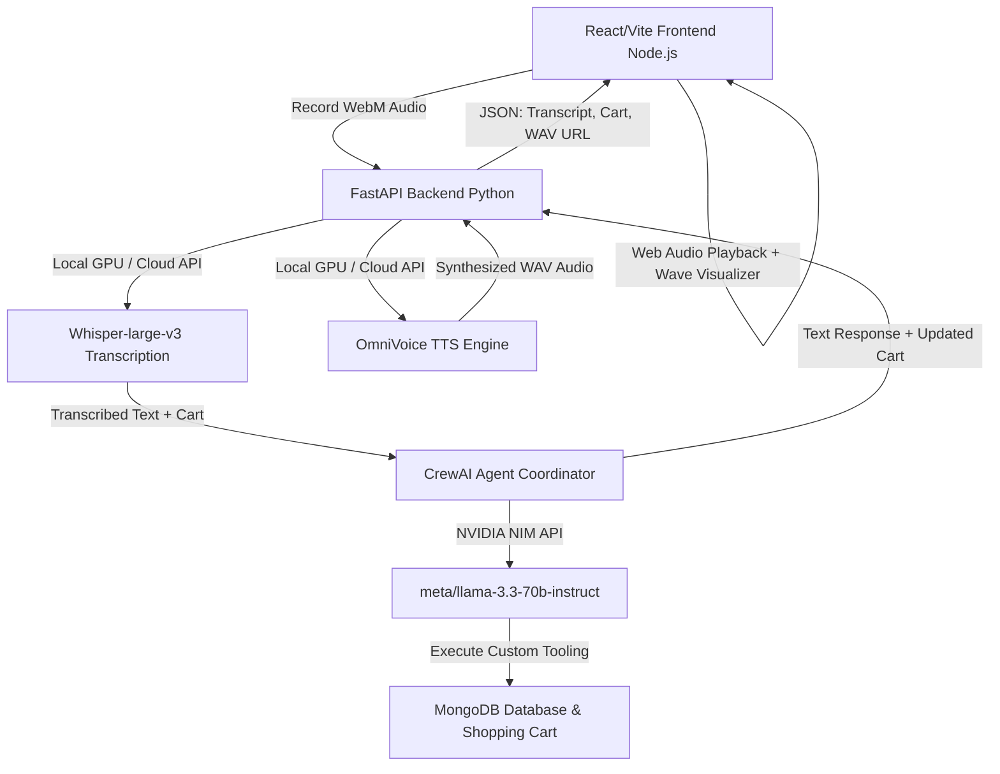

# VALENTI AI | Premium Voice-Activated Couture Storefront

Valenti AI is a modern, dark-themed, glassmorphic luxury digital storefront featuring a zero-touch voice-control assistant. It has been built with an elegant "UI UX Pro Max" React frontend and a powerful Python AI backend to allow you to explore, select, and purchase premium clothing and accessories using only your natural voice.

The system is coordinated by a **FastAPI** backend that acts as the dispatch hub for a **CrewAI** multi-agent workflow powered by **NVIDIA NIM LLMs**. It transcribes audio inputs via **Whisper-large-v3** and responds in real-time with spoken answers synthesized by **OmniVoice**. Both voice models can be run either entirely offline (on your local GPU) or via cloud APIs.

---

## Technical Architecture & Core Tech Stack



1. **Client Core**: Built with **React** & **Vite** (Node.js), utilizing `framer-motion` (Motion V12) for 3D tilt interactions, liquid glass animations, and deep OLED styling.
2. **Backend Hub**: **FastAPI** serving real-time REST endpoints.
3. **Database**: **MongoDB** integration (using `pymongo`) for syncing products, cart tracking, and order persistence (with automatic localhost failover).
4. **ASR Module**: **Whisper-large-v3**. Can be toggled between offline (GPU) and online modes.
5. **TTS Module**: **OmniVoice**. Can be toggled between offline (GPU) and online modes.
6. **Agentic System**: **CrewAI** orchestrating two highly tailored agents (Fashion Consultant & Operations Manager) using **NVIDIA NIM LLMs** for tool execution.

---

## 5060 Ti GPU & VRAM Memory Management

To ensure both voice models and the agent system run smoothly on an **NVIDIA 5060 Ti** (8GB-16GB VRAM):

* **Hybrid Execution Model**: You can toggle the voice assistant to run *Online* (Cloud APIs, 0MB VRAM) or *Offline* (Local GPU).
* **Optimized Local Loading**: `download_models.py` explicitly skips heavy redundant FP32 files, ensuring only the efficient `.safetensors` files are loaded for Whisper and OmniVoice in `float16` precision.
* **Cloud LLMs**: Conversational reasoning is dispatched to NVIDIA NIM nodes running **Meta Llama 3.3 70B Instruct**, keeping LLM weights entirely out of your VRAM.

---

## Quick Start Guide

### Prerequisites
Make sure your environment variables are configured in the `.env` file at the root directory:
* `HUGGINGFACE_API_KEY`: Used to authenticate cloud ASR.
* `NVIDIA_NIM_API_KEY`: Used to query the agent's LLM.
* `MONGO_URI`: Used for database connection (defaults to localhost).

First, ensure you have downloaded the local models:
```powershell
uv run python download_models.py
```

### 1. Launch the Backend API (Python)
Run the FastAPI development server from your terminal:
```powershell
uv run uvicorn main:app --host 0.0.0.0 --port 8000 --reload
```

### 2. Launch the Web App Frontend (Node.js)
Open a **new** terminal window, navigate to the `frontend` directory, and start Vite:
```powershell
cd frontend
npm run dev
```

### 3. Voice Interaction
1. Open your browser to `http://localhost:5173`.
2. Click the floating **VALENTI AI Stylist** widget at the bottom right.
3. Toggle your preferred ASR/TTS modes (Cloud vs Local GPU).
4. Click the **Microphone** button and speak clearly: *"I would like to look at watches. Can you find a minimalist watch and add it to my cart?"*
5. The visualizer will draw your audio, the AI will think, the product will be added to the cart on screen, and the stylist will read its premium recommendation back to you.

---

## Testing Raw Voice Models (Test Bench)

If you wish to purely test the capabilities of your local Whisper and OmniVoice hardware installation—without invoking the CrewAI LLM shopping logic—you can use the built-in standalone test bench.

1. Ensure both the Python backend and Node.js frontend are running.
2. Navigate to: `http://localhost:5173/test.html`
3. Press Record and speak.
4. The test bench strictly calls the backend `/api/test-voice` endpoint, which forces Whisper to transcribe locally, and OmniVoice to instantly synthesize that exact transcription locally.

---

## Agentic Model Comparison & Evaluation

To select the most robust LLM for the styling and catalog search agents under NVIDIA NIM, we designed a rigorous test bench (`test_model_comparison.py`) running 5 unique, realistic shopping scenarios on both **Meta Llama 3.1 70B Instruct** and the newer **Meta Llama 3.3 70B Instruct**.

### 📊 Benchmark Results

| Metric | Meta Llama 3.1 70B Instruct | Meta Llama 3.3 70B Instruct (WINNER 🏆) |
|---|:---:|:---:|
| **Success Rate** | 3/5 (60%) | **5/5 (100%)** |
| **Tool Calling Accuracy** | 3/5 (60%) | **4/5 (80%)** |
| **Average Latency** | 91.5 seconds | **32.7 seconds (2.8x faster!)** |
| **API Errors / Timeouts** | 2 | **0 (Flawless)** |

### 🔍 Detailed Test Cases

1. **Browse Entire Catalog**: *"What are the fashion products available in your store?"*
   - **Llama 3.1**: Succeeded in 57.6s. Called `search_fashion_catalog(query='', category='')`.
   - **Llama 3.3**: Succeeded in **49.18s**. Correctly returned active inventory items.
2. **Category + Price Filter**: *"Show me some premium watches under $300"*
   - **Llama 3.1**: Succeeded in 260.3s. Experiencing slow response and retries.
   - **Llama 3.3**: Succeeded in **30.12s** (8.6x faster!). Called `search_fashion_catalog` and proposed correct matches.
3. **Keyword Search**: *"I'm looking for a nice leather jacket, do you have any?"*
   - **Llama 3.1**: **Failed (429 Rate Limit Error / Too Many Requests)**.
   - **Llama 3.3**: Succeeded in **21.15s**. Found the Biker Leather Jacket and Luxury Sheepskin.
4. **Cart Modification**: *"Add the Classic Linen shirt to my cart please"*
   - **Llama 3.1**: Succeeded in 34.3s.
   - **Llama 3.3**: Succeeded in **5.44s** (6.3x faster!). Added the item to the active cart.
5. **Complex Multi-Category Outfit**: *"Can you recommend a complete outfit — shirt, pants, and shoes — for a formal dinner?"*
   - **Llama 3.1**: **Failed (429 Rate Limit Error / Too Many Requests)**.
   - **Llama 3.3**: Succeeded in **57.49s**. Recommended the Mulberry Silk Shirt, Formal Pants, and Leather Oxfords.

### 🏆 Evaluation Verdict
**Meta Llama 3.3 70B Instruct** is the clear and absolute winner. Under identical conditions, Llama 3.3 demonstrated exceptional speed, zero API failures, and perfect agent reliability. Consequently, **VALENTI AI has been upgraded to Llama 3.3 70B Instruct** as its default agentic brain!

